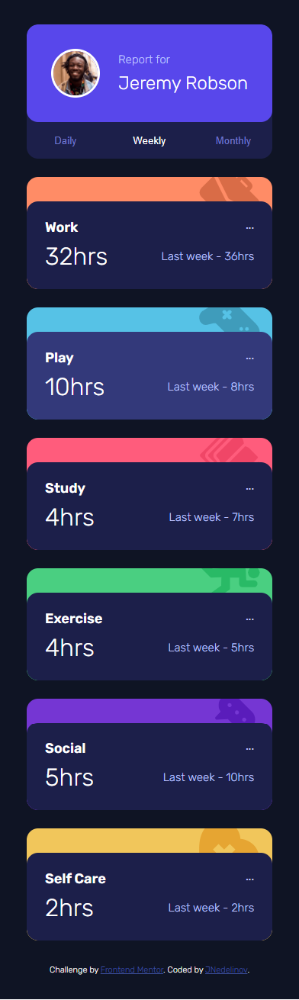
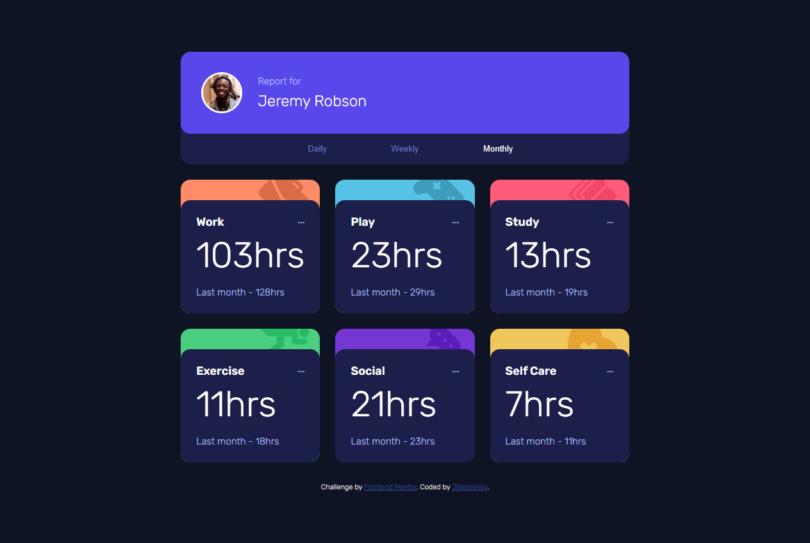
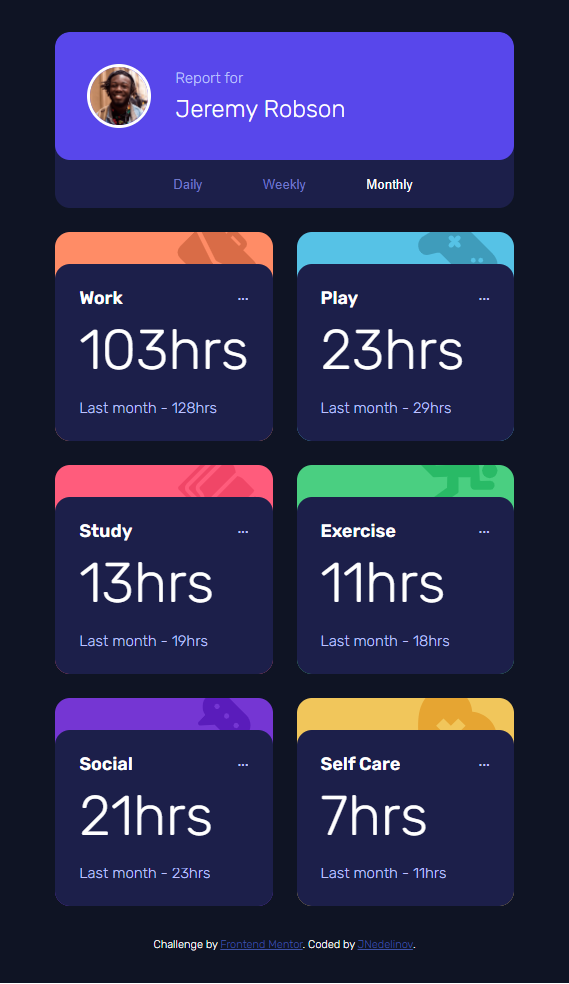
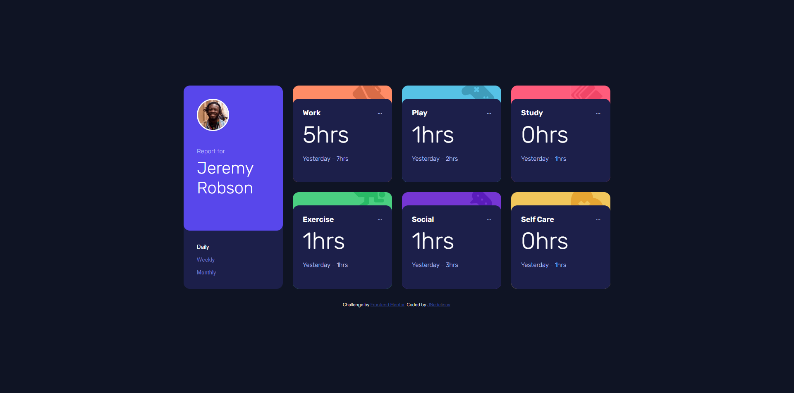
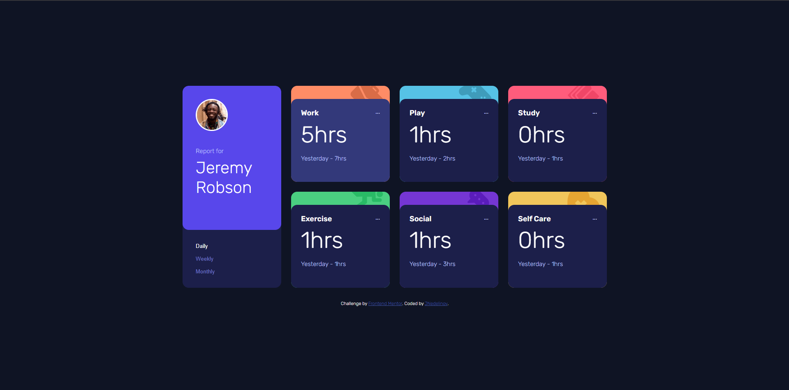

# Frontend Mentor - Time tracking dashboard solution

This is a solution to the [Time tracking dashboard challenge on Frontend Mentor](https://www.frontendmentor.io/challenges/time-tracking-dashboard-UIQ7167Jw)

## Table of contents

- [Frontend Mentor - Time tracking dashboard solution](#frontend-mentor---time-tracking-dashboard-solution)
  - [Table of contents](#table-of-contents)
  - [Overview](#overview)
    - [The challenge](#the-challenge)
    - [Screenshot](#screenshot)
    - [Links](#links)
  - [My process](#my-process)
    - [Built with](#built-with)
    - [What I learned](#what-i-learned)
    - [AI Collaboration](#ai-collaboration)
  - [Author](#author)

## Overview

### The challenge

Users should be able to:

- View the optimal layout for the site depending on their device's screen size
- See hover states for all interactive elements on the page
- Switch between viewing Daily, Weekly, and Monthly stats

### Screenshot

| Mobile                                 | Tablet                                  | Tablet Mini                                 | Desktop                                 |
| :------------------------------------- | :-------------------------------------- | :------------------------------------------ | :-------------------------------------- |
|  |  |  |  |

| Hover                                          |
| :--------------------------------------------- |
|  |

### Links

- Solution URL: [here](https://github.com/JNedelinov/time-tracking-dashboard/tree/main)
- Live Site URL: [here](https://jnedelinov-time-tracking.netlify.app/)

## My process

### Built with

- Semantic HTML5 markup
- Mobile-first workflow
- Vanilla JS
- Less.js
- CSS Flexbox
- CSS Grid

### What I learned

I discovered a major "gotcha" with DOM manipulation: the danger of **innerHTML +=**.

- When you append HTML using **element.innerHTML += newHTML**, the browser *completely destroys* and *rebuilds all* existing child nodes inside that element.
- This **wipes out** any attached event listeners (like removing a sticky note and replacing it with a blank one).
- **The Fix**: I learned to use element.insertAdjacentHTML('beforeend', newHTML) to safely add new content to the DOM without breaking my existing interactive buttons.

### AI Collaboration

During this challenge, I used an AI assistant to help me debug a frustrating issue where my JavaScript event listeners were disappearing after the first interaction. 
Instead of asking the AI to write the code for me, I used it to understand the why behind the bug.

- The Problem: My timeframe filter buttons worked once, but after the new data rendered, they became unclickable.
- The Process: I shared my code with the AI and walked through my logic. I had correctly used the .remove() method to clear old cards, but the bug was hiding in how I added the new ones.
- The Breakthrough: The AI provided a "sticky note" mental model to explain how event listeners are attached to specific DOM nodes. I learned that using container.innerHTML += newHTML doesn't just append text; it forces the browser to destroy and rebuild every element inside that container, completely wiping out the existing buttons and their attached event listeners.
- The Solution: With this new understanding, I swapped my approach to use insertAdjacentHTML('beforeend', newHTML). This allowed me to safely inject the new timesheet cards into the DOM without touching the existing, interactive button nodes.

## Author

- GitHub - [@JNedelinov](https://github.com/JNedelinov)
- Frontend Mentor - [@JNedelinov](https://www.frontendmentor.io/profile/JNedelinov)
- LinkedIn - [@Zhulien Zhivkov](https://www.linkedin.com/in/zhulien-zhivkov-493889119/)
